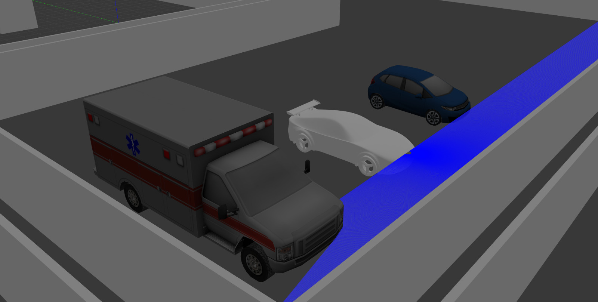
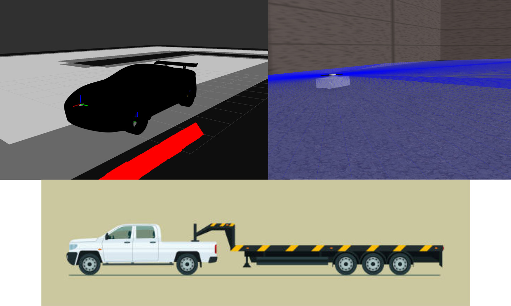
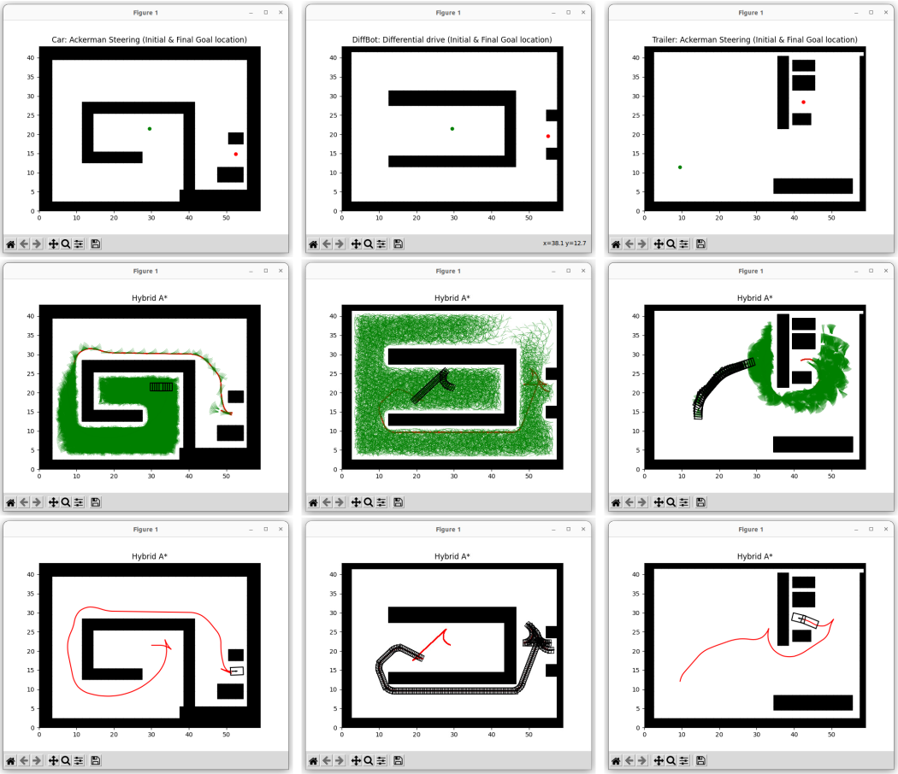
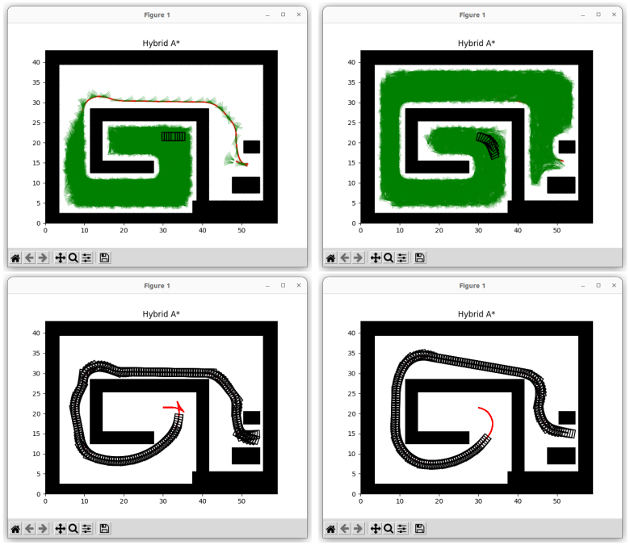

This report details the implementation of a kinematic path planner to park three vehicles of varying complexity into a confined space. The vehicles—a delivery robot, a car, and a truck with a trailer—each had distinct steering constraints. A simulated 2D environment with obstacles was created, and the configuration space was modeled to account for nonholonomic constraints. Custom path planning algorithms were developed to generate feasible paths that satisfy the kinodynamic constraints, guiding each vehicle from its starting position to the target parking spot. The resulting paths are presented alongside snapshots illustrating the parking maneuvers. While simplistic, this project effectively demonstrates automated parking for nonholonomic vehicles in cluttered environments.

## Introduction
This project focuses on developing path-planning algorithms to park vehicles in a cluttered environment. The goal is to maneuver three different vehicles, each with unique steering constraints, from their starting positions into a tight parking spot while avoiding collisions—an essential challenge for autonomous vehicles in urban settings. The simulated 2D environment is a parking lot with obstacles on two sides of the target parking space and additional obstructions in the middle. The vehicles must skillfully navigate around these obstacles, making full use of their steering capabilities to park efficiently in the compact space. 

The three vehicles, listed in order of increasing complexity, are:
- **Delivery robot:** Differential drive/skid steering
- **Car:** Ackermann steering
- **Truck with trailer:** Ackermann steering combined with trailer kinematics

Each vehicle is subject to nonholonomic constraints based on its steering mechanism. The path planner employs a hybrid A* algorithm that accounts for these constraints, generating feasible trajectories for each vehicle. This project successfully demonstrates automated parking for vehicles with different steering configurations in a confined space using a tailored motion planning algorithm.

## Methods
The path planning approach utilizes a hybrid A* search algorithm to generate optimal parking trajectories for each vehicle. This method extends the traditional A* graph search by incorporating kinodynamic constraints into the cost function.

### Simulation
The entire parking scenario was simulated using Pyplot, ROS2, and Gazebo. Pyplot facilitated easy visualization and algorithm development in a 2D environment, while ROS2 provided the infrastructure for controlling the vehicles and visualizing the environment. Gazebo managed the physics simulation and rendering, creating a realistic and interactive setup.

### Collision Checking
Working with continuous spaces can be challenging, particularly for path planning and collision detection. By discretizing the space into smaller, manageable states, the problem becomes more tractable. This approach allows the algorithm to perform collision checks by examining a finite set of states rather than evaluating the entire continuous space.

### Discrete Motion Planning with Nonholonomic Constraints
Kinodynamic planning is essential for vehicles with nonholonomic constraints, such as cars or robots with differential drive systems, as these systems cannot instantly change velocity or direction. They require planning that accounts for their specific dynamics to generate feasible trajectories. Detailed diagrams and explanations of this concept are provided in the appendix section.

### Hybrid A* Algorithm
The hybrid A* algorithm extends traditional A* by integrating kinodynamic constraints into the path planning process. At each iteration, the algorithm evaluates reachable configurations based on the vehicle's kinematics and selects the lowest cost node using the A* evaluation function: \( f(n) = g(n) + h(n) \). Here, \( g(n) \) represents the path cost from the start to node \( n \), while \( h(n) \) estimates the cost to reach the goal. The kinodynamic constraints are embedded within \( g(n) \) to filter out infeasible motions.

This iterative process continues, expanding nodes until the goal is reached. The resulting optimal path minimizes traversal costs while adhering to steering constraints, and is subsequently converted into a time-parameterized trajectory using the vehicle's kinematic model. The complete scenario was simulated using Matplotlib, with ROS2 and Gazebo handling the physics and visualizations.

## Results
The hybrid A* path planner successfully generated collision-free trajectories for all three vehicles, allowing them to park in the designated space.

Delivery Robot: The planner produced a smooth path that effectively utilized the differential drive constraints, enabling the robot to neatly maneuver around obstacles to reach the goal position. The planned path is shown in the corresponding figure overlaid on the environment map.

Sedan: The sedan also navigated the cluttered parking lot efficiently, as seen in the figure. The Ackermann steering constraints resulted in wider turns compared to the delivery robot, but the planner successfully accounted for these limitations.

Truck with Trailer: The truck with trailer posed the most significant challenge due to the added complexity of trailer kinematics. Despite this, the hybrid A* planner accounted for these constraints and generated a feasible path to the goal, as shown in the figure. Executing this maneuver required precise tuning of velocities and accelerations.

All vehicles successfully avoided collisions, demonstrating the planner's ability to handle different steering configurations and navigate within their steering limitations.

## Conclusion:
Here's a concise section to include this summary in your README file:

---

### **Conclusion**

This project demonstrated the successful path planning and control of various steered vehicles for parking in tight spaces. The hybrid A* motion planning algorithm proved effective in generating optimal, collision-free trajectories while accounting for the kinodynamic constraints of each vehicle model.

- **Performance**: On average, parking was completed within 20-35 seconds for all vehicles, with the planner effectively balancing the exploration of configuration space and the exploitation of the lowest cost paths. While paths were optimal in terms of length, further optimization could be achieved for time efficiency.
  
- **Potential Improvements**: Smoother velocity profiles could minimize accelerations and jerks, and incorporating dynamic constraints within the kinodynamic framework may generate time-optimal trajectories. Additionally, fine-tuning heuristic functions could improve planning times.

- **Future Extensions**: The system can be extended to handle more complex vehicles, tighter environments, and dynamic obstacles.

Overall, this project demonstrated the effectiveness of using the hybrid A* motion planning method for automated parking of nonholonomic vehicles.

